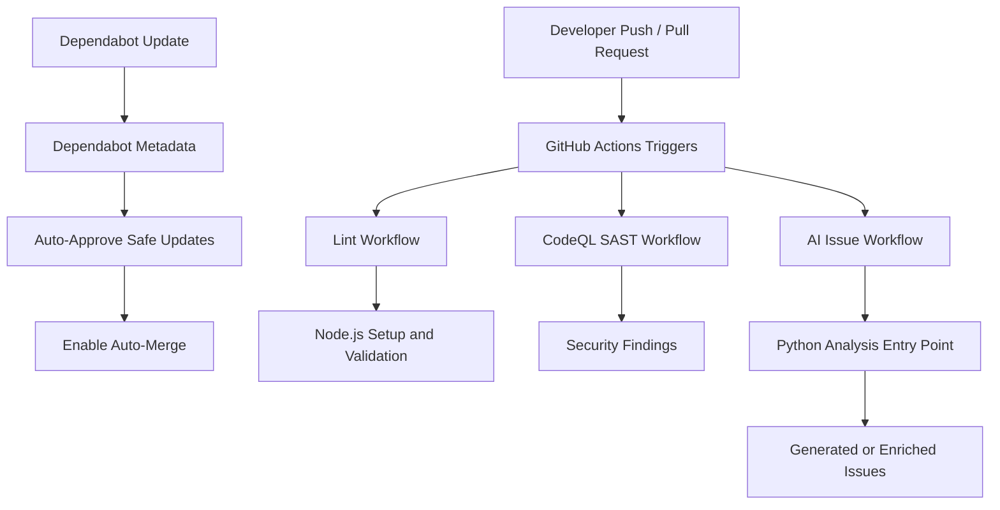
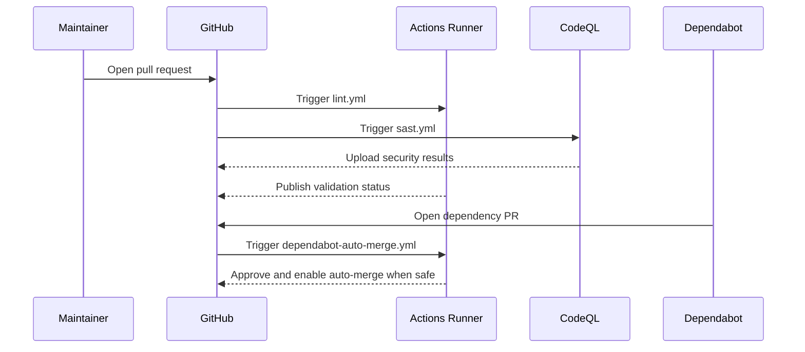

<div align="center">

<pre>
                                                                                           
                               ,,        ,,                 ,,                             
                             `7MM      `7MM               `7MM                             
                               MM        MM                 MM                             
`7M'   `MF'`7MMpMMMb.pMMMb.    MM        MMpMMMb.  .gP"Ya   MM `7MMpdMAo.  .gP"Ya `7Mb,od8 
  VA   ,V    MM    MM    MM    MM        MM    MM ,M'   Yb  MM   MM   `Wb ,M'   Yb  MM' "' 
   VA ,V     MM    MM    MM    MM        MM    MM 8M""""""  MM   MM    M8 8M""""""  MM     
    VVV      MM    MM    MM    MM        MM    MM YM.    ,  MM   MM   ,AP YM.    ,  MM     
    ,V     .JMML  JMML  JMML..JMML.    .JMML  JMML.`Mbmmd'.JMML. MMbmmd'   `Mbmmd'.JMML.   
   ,V                                                            MM                        
OOb"                                                           .JMML.                      
</pre>

A repository-automation and delivery blueprint for a logging library, consolidating GitHub Actions, dependency governance, security scanning, issue intake, and maintainer funding metadata in one place.

[](LICENSE)
[](#testing)
[](#deployment)
[](#configuration)
[](#tech-stack--architecture)

</div>

> [!IMPORTANT]
> This repository currently contains project governance, CI/CD, security, and issue-management YAML for a logging-library codebase. The library implementation files themselves are not present in this checkout, so this README documents the operational layer that supports the library lifecycle. [View the operational scripts in this Gist](https://gist.github.com/OstinUA/524288d1f966b0430085542f4d0b4521).

## Table of Contents

- [Title and Description](#yml_helper)
- [Features](#features)
- [Tech Stack & Architecture](#tech-stack--architecture)
  - [Core Stack](#core-stack)
  - [Project Structure](#project-structure)
  - [What Each YAML File Does](#what-each-yaml-file-does)
  - [Key Design Decisions](#key-design-decisions)
- [Getting Started](#getting-started)
  - [Prerequisites](#prerequisites)
  - [Installation](#installation)
- [Testing](#testing)
- [Deployment](#deployment)
- [Usage](#usage)
- [Configuration](#configuration)
  - [GitHub Actions Secrets](#github-actions-secrets)
  - [Workflow Triggers and Inputs](#workflow-triggers-and-inputs)
  - [Funding Metadata](#funding-metadata)
  - [Issue Template Configuration](#issue-template-configuration)
- [License](#license)
- [Contacts & Community Support](#contacts--community-support)

## Features

- Centralizes GitHub repository automation for a logging-library project in auditable YAML manifests.
- Enforces dependency hygiene with scheduled `Dependabot` updates for both Python and GitHub Actions ecosystems.
- Auto-approves and auto-merges safe `Dependabot` patch and minor upgrades to reduce maintenance overhead.
- Runs lint-oriented pull request checks, including Node.js bootstrap, optional package-lock generation, and JavaScript syntax validation.
- Executes scheduled and on-demand `CodeQL` SAST scanning for JavaScript and TypeScript attack-surface analysis.
- Provides an AI-assisted issue generation workflow that can inspect pushes and pull requests and execute a Python analysis entrypoint.
- Standardizes issue intake through structured bug-report and feature-request forms.
- Ships a reusable pull-request template that captures change type, validation steps, and review hygiene.
- Publishes maintainer funding channels through GitHub Sponsors-compatible metadata.
- Keeps repository operations declarative, reviewable, and easy to fork or transplant into another logging-related project.

> [!NOTE]
> Because the repository is configuration-centric, the primary “runtime” of this project is GitHub itself: workflow runners, issue forms, pull-request automation, and repository metadata.

## Tech Stack & Architecture

### Core Stack

- `YAML`: Primary configuration language for GitHub Actions workflows, issue forms, funding configuration, and dependency automation.
- `Markdown`: Human-facing project documentation and pull-request template content.
- `GitHub Actions`: CI/CD orchestration and policy execution engine.
- `Node.js 20`: Used by the lint workflow to install dependencies and run optional linting or syntax checks.
- `Python 3.11`: Used by the AI-analysis workflow to execute `trigger action/trigger_action.py` with GitHub event context.
- `CodeQL`: Static Application Security Testing engine for JavaScript/TypeScript analysis.
- `Dependabot`: Automated update management for package and GitHub Action dependency drift.

### Project Structure

```text
.
├── .github/
│   ├── FUNDING.yml
│   ├── dependabot.yml
│   ├── pull_request_template.md
│   ├── ISSUE_TEMPLATE/
│   │   ├── bug_report.yml
│   │   └── feature_request.yml
│   └── workflows/
│       ├── ai-issue.yml
│       ├── dependabot-auto-merge.yml
│       ├── lint.yml
│       └── sast.yml
├── LICENSE
├── README.md
└── trigger action/
    └── trigger_action.py
```

### What Each YAML File Does

The repository is intentionally small, so every YAML file has a specific operational role:

| File | Purpose | Operational Impact |
| --- | --- | --- |
| `.github/FUNDING.yml` | Declares GitHub-recognized funding platforms and custom donation links. | Exposes support links in the repository UI and centralizes maintainer sponsorship metadata. |
| `.github/dependabot.yml` | Configures weekly update scans for `pip` and `github-actions`. | Keeps Python dependencies and workflow action versions from drifting or missing security patches. |
| `.github/workflows/ai-issue.yml` | Runs an AI-assisted analysis pipeline on `push` to `main` and selected pull-request events. | Installs Python dependencies, injects GitHub event metadata, and executes `trigger action/trigger_action.py` to create or enrich issues. |
| `.github/workflows/dependabot-auto-merge.yml` | Reviews pull requests opened by `dependabot[bot]`. | Automatically approves and enables merge automation for safe patch/minor dependency updates. |
| `.github/workflows/lint.yml` | Performs pull-request lint and static validation. | Bootstraps Node.js, creates `package-lock.json` when absent, optionally runs the repo lint script, and validates JavaScript syntax under `api/`. |
| `.github/workflows/sast.yml` | Executes `CodeQL` static analysis. | Scans JavaScript/TypeScript code on PRs, manual dispatches, and a weekly schedule to surface security findings. |
| `.github/ISSUE_TEMPLATE/bug_report.yml` | Structured bug report form. | Forces reproducibility details, expected behavior, actual traces, and environment context. |
| `.github/ISSUE_TEMPLATE/feature_request.yml` | Structured feature proposal form. | Captures problem context, proposed solution, and alternatives for roadmap triage. |

> [!TIP]
> If you fork this repository for another service, start by adjusting `.github/dependabot.yml`, `lint.yml`, and `sast.yml`; those three files define most of the automated maintenance posture.

### Key Design Decisions

1. `GitHub-native automation over custom infrastructure`
   - The project leans on built-in GitHub primitives such as Actions, issue forms, scheduled workflows, repository funding, and PR templates.
   - This keeps the operational surface area small and avoids maintaining a separate CI orchestrator.

2. `Policy as code`
   - Maintenance behavior is encoded in version-controlled YAML rather than implicit repository settings.
   - Every workflow change can be reviewed, diffed, and audited like application code.

3. `Separation of concerns`
   - Dependency updates, security scanning, linting, and AI-assisted triage each live in distinct workflow files.
   - This improves debuggability and reduces accidental coupling between maintenance tasks.

4. `Safe-by-default automation`
   - Auto-merge is restricted to non-breaking `Dependabot` patch/minor updates.
   - Higher-risk changes still require human review.

5. `Mixed runtime support`
   - The repository anticipates both Python-centric automation (`trigger action/trigger_action.py`) and JavaScript/TypeScript code scanning/linting.
   - This is a pragmatic design for logging projects that may expose SDKs, CLIs, dashboards, or integrations across multiple runtimes.

#### Workflow Topology



#### Logging-Library Delivery Context



## Getting Started

### Prerequisites

To work with this repository locally, you should have:

- `git` for cloning and version-control operations.
- `Node.js 20` and `npm` to emulate the lint workflow locally.
- `Python 3.11` and `pip` to emulate the AI workflow dependency installation.
- A GitHub repository with Actions enabled if you want the workflows to execute end to end.
- Optional: `gh` CLI for testing PR-review or merge commands used by the Dependabot automation.

> [!WARNING]
> The `ai-issue.yml` workflow invokes `trigger action/trigger_action.py`. Ensure the required Python dependencies and GitHub tokens are configured before enabling or dispatching the job.

### Installation

1. Clone the repository.
2. Enter the project directory.
3. Install the runtime dependencies you need for local workflow emulation.

```bash
git clone <your-fork-or-repository-url>
cd yml_helper

npm install --no-audit --no-fund
pip install PyGithub requests
```

If your logging library lives in a separate repository, copy or vendor the `.github/` directory into that project and then tailor the workflow assumptions to the actual code layout.

## Testing

This repository does not currently ship an application test suite. Validation is primarily configuration- and workflow-oriented.

### Recommended local checks

```bash
# Markdown and repository hygiene
cat README.md

# Validate YAML syntax when yq is available
yq '.' .github/dependabot.yml > /dev/null
yq '.' .github/FUNDING.yml > /dev/null
yq '.' .github/workflows/ai-issue.yml > /dev/null
yq '.' .github/workflows/dependabot-auto-merge.yml > /dev/null
yq '.' .github/workflows/lint.yml > /dev/null
yq '.' .github/workflows/sast.yml > /dev/null
yq '.' .github/ISSUE_TEMPLATE/bug_report.yml > /dev/null
yq '.' .github/ISSUE_TEMPLATE/feature_request.yml > /dev/null

# Reproduce the Node-based lint workflow behavior
npm install --no-audit --no-fund
npm run lint --if-present

# Validate JavaScript syntax if an api/ directory exists
find api -type f -name '*.js' -print0 | xargs -0 -I{} node --check "{}"
```

### GitHub-side checks

- Open a pull request to trigger `lint.yml` and `sast.yml`.
- Use `workflow_dispatch` for manual execution of `lint.yml` or `sast.yml`.
- Open a test `Dependabot` PR or modify `dependabot.yml` schedules to validate update automation.
- Push to `main` or open a pull request to validate `ai-issue.yml` using `trigger action/trigger_action.py`.

> [!CAUTION]
> The repository currently references tooling and scripts that may not exist yet in a fresh checkout, so local test execution may be partially conditional until the companion library codebase is present.

## Deployment

For this repository, “deployment” means rolling workflow and governance changes into a GitHub repository used by the logging library.

### Production rollout model

1. Merge workflow changes into the default branch.
2. Ensure repository secrets are populated before enabling workflows that depend on them.
3. Confirm GitHub Actions permissions align with the workflow declarations.
4. Observe the first scheduled or manually dispatched runs for permissions and path mismatches.

### CI/CD integration guidance

- Treat `.github/workflows/*.yml` as production infrastructure code.
- Require pull-request review for workflow changes.
- Use protected branches so auto-merge only operates after required checks succeed.
- Keep the CodeQL schedule enabled for baseline security drift detection.
- Version workflow logic alongside the logging library code so release branches inherit the correct automation posture.

### Containerization

There is no Dockerfile or Compose stack in the current repository snapshot. If your logging library is containerized elsewhere, mount or copy this `.github/` configuration into that source repository rather than trying to “deploy” this repository as a standalone service.

## Usage

Because this project is automation-first, usage is mostly operational rather than API-driven.

### Example: adopting the workflow set in a logging library repository

```bash
# Clone your logging library repository
cd /path/to/logging-library

# Copy the automation assets into the target repository
cp -R /path/to/yml_helper/.github .
cp /path/to/yml_helper/README.md ./docs/repo-automation.md
```

### Example: customizing the Dependabot schedule

```yaml
version: 2
updates:
  - package-ecosystem: "pip"
    directory: "/"
    schedule:
      interval: "daily" # Increase scan frequency for security-sensitive projects
    labels:
      - "dependencies"
      - "python"
```

### Example: invoking the AI workflow prerequisites

```bash
# Install the Python dependencies expected by ai-issue.yml
pip install PyGithub requests

# Provide the same environment variables used in GitHub Actions
export GITHUB_TOKEN="<token>"
export REPOSITORY="owner/repo"
export EVENT_NAME="pull_request"
export COMMIT_SHA="<sha>"
export PR_NUMBER="123"
export GH_MODELS_TOKEN="<models-token>"
export ALLOWED_USER="<github-login>"

# Run the analysis entrypoint
python "trigger action/trigger_action.py"
```

### Example: lint workflow behavior

```bash
# Mirror the GitHub Actions lint job locally
npm install --no-audit --no-fund
npm run lint --if-present

# Validate JavaScript files when the repository contains an api/ directory
if [ -d api ]; then
  find api -type f -name '*.js' -print0 | xargs -0 -I{} node --check "{}"
fi
```

## Configuration

### GitHub Actions Secrets

The repository references the following secrets and environment variables:

| Name | Required By | Purpose |
| --- | --- | --- |
| `GITHUB_TOKEN` | Multiple workflows | Authenticates GitHub API and CLI actions using the repository-scoped token. |
| `GH_MODELS_TOKEN` | `ai-issue.yml` | Supplies credentials for the AI model provider consumed by `trigger action/trigger_action.py`. |
| `ALLOWED_USER` | `ai-issue.yml` | Constrains or validates which actor may use the AI-assisted workflow behavior. |
| `REPOSITORY` | `ai-issue.yml` | Passes the current `owner/name` repository identifier into the Python entrypoint. |
| `EVENT_NAME` | `ai-issue.yml` | Provides the GitHub event type being processed. |
| `COMMIT_SHA` | `ai-issue.yml` | Provides the commit under analysis. |
| `PR_NUMBER` | `ai-issue.yml` | Provides the pull request number when available. |
| `GH_TOKEN` | `dependabot-auto-merge.yml` | Authenticates `gh pr review` and `gh pr merge` operations. |

### Workflow Triggers and Inputs

| Workflow | Trigger | Key Runtime Assumptions |
| --- | --- | --- |
| `ai-issue.yml` | `push` to `main`; PR events `opened`, `synchronize`, `labeled` | Requires `trigger action/trigger_action.py`, Python 3.11, GitHub and model tokens. |
| `dependabot-auto-merge.yml` | Dependabot PR `opened`, `reopened`, `synchronize`, `ready_for_review` | Requires `gh` CLI on runner and permissions to write PR metadata. |
| `lint.yml` | Any pull request; manual dispatch | Assumes a Node-capable repository and optionally an `api/` directory. |
| `sast.yml` | Any pull request; manual dispatch; weekly Monday cron | Assumes JavaScript/TypeScript code is present for CodeQL to analyze. |

### Funding Metadata

`.github/FUNDING.yml` currently advertises the following support channels:

- `GitHub Sponsors`: `OstinUA`
- `Patreon`: `OstinFCT`
- `Ko-fi`: `fctostin`
- `Boosty`: custom URL
- `Telegram`: custom URL
- `YouTube`: custom URL

### Issue Template Configuration

The issue forms are opinionated and useful for operational maturity:

- `bug_report.yml` emphasizes duplicate checks, exact environment details, reproducible steps, expected behavior, and traceback capture.
- `feature_request.yml` emphasizes problem framing, proposed solution narratives, and alternative approaches.

> [!NOTE]
> If your logging library needs user-facing support workflows, these issue forms are a strong baseline and can be extended with version selectors, runtime targets, or transport backends such as console, file, syslog, or OpenTelemetry.

## License

This repository is licensed under the Apache License 2.0. See [`LICENSE`](LICENSE) for the full text.

## Contacts & Community Support

## Support the Project

[](https://www.patreon.com/OstinFCT)
[](https://ko-fi.com/fctostin)
[](https://boosty.to/ostinfct)
[](https://www.youtube.com/@FCT-Ostin)
[](https://t.me/FCTostin)

If you find this tool useful, consider leaving a star on GitHub or supporting the author directly.
